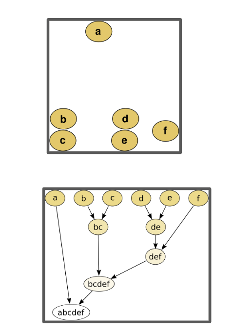

Here's your `.txt` file reformatted as clean, structured Markdown with appropriate headers, subheaders, code formatting, and reference links:

---

# Hierarchical Clustering

## Review

### Clustering

**Input/Output**:
A dendrogram categorizing cluster similarity.


---

## Methods

### Agglomerative

Agglomerative clustering, often referred to as a "bottom-up" approach, begins with each data point as an individual cluster. At each step, the algorithm merges the two most similar clusters based on a chosen distance metric (e.g., Euclidean distance) and linkage criterion (e.g., single-linkage, complete-linkage) \[2]. This process continues until all data points are combined into a single cluster or a stopping criterion is met. Agglomerative methods are more commonly used due to their simplicity and computational efficiency for small to medium-sized datasets \[3].

### Divisive

Divisive clustering, known as a "top-down" approach, starts with all data points in a single cluster and recursively splits the cluster into smaller ones. At each step, the algorithm selects a cluster and divides it into two or more subsets, often using a criterion such as maximizing the distance between resulting clusters. Divisive methods are less common but can be useful when the goal is to identify large, distinct clusters first.

[Wikipedia - Hierarchical Clustering](https://en.wikipedia.org/wiki/Hierarchical_clustering)

---

## Linkage Criterion

* **Single-Link**
  $D(X,Y) = \min d(x,y) \quad \text{for each } x \in X, y \in Y$

* **Complete-Link**
  $D(X,Y) = \max d(x,y) \quad \text{for each } x \in X, y \in Y$

---

## Naive Approach

**Complexity**: $O(n^3)$
**Memory Complexity**: $O(n^2)$

```python
groups = pairs.len
while groups != 1:
    pair = find_closest_pair(points)
    merge(pair)  # removes pair from distance matrix and marks in dendrogram
    groups -= 1

def find_closest_pair(points):
    for p1 in points:
        for p2 in (points after p1):
            if distance[p1][p2] < min:
                ...
    return point
```

---

## Merging

Within `merge`, must update the distance matrix such that, for a new cluster $j \cup i$:

* For **single link**:
  $D(j \cup i, k) = \min(d(i,k), d(j,k))$

* For **complete link**:
  $D(j \cup i, k) = \max(d(i,k), d(j,k))$

This step is also $O(n^2)$.

---

## SLINK / CLINK Algorithm

Sibson proposed an algorithm with time complexity $O(n^2)$ and space complexity $O(n)$, known as **SLINK**. It represents clustering using two functions:

* $\pi(i)$: maps item $i$ to the largest-numbered item in the smallest cluster $C$ containing $i$ and a larger-numbered item.
* $\lambda(i)$: maps item $i$ to the distance associated with creation of cluster $C$.

These are stored in two arrays, using $O(n)$ space. This representation is sufficient to determine clustering.

When a new item is added, the updated representation is computed in $O(n)$, looping over items one-by-one.

[SLINK\_CLINK GitHub](https://github.com/jackyust/SLINK_CLINK)

---

## Current Tools

* [SciPy Hierarchy Module](https://docs.scipy.org/doc/scipy/reference/cluster.hierarchy.html#module-scipy.cluster.hierarchy)
* [SciPy Implementation Source](https://github.com/scipy/scipy/blob/main/scipy/cluster/hierarchy.py#L814)

**References Cited by SciPy**:
\[1] Daniel Müllner, *Modern hierarchical, agglomerative clustering algorithms*, [arXiv:1109.2378v1](https://arxiv.org/pdf/1109.2378)
\[2] Ziv Bar-Joseph et al., *Fast optimal leaf ordering for hierarchical clustering*, [DOI](https://doi.org/10.1093/bioinformatics/17.suppl_1.S22)
[fastcluster package on CRAN](https://cran.r-project.org/web/packages/fastcluster/)

---

## SciPy Implementation (in `_hierarchy.pyx`)

```python
if method == 'single':
    return _hierarchy.mst_single_linkage(y, n)
elif method in ('complete', 'average', 'weighted', 'ward'):
    return _hierarchy.nn_chain(y, n, method_code)
else:
    return _hierarchy.fast_linkage(y, n, method_code)
```

### Functions

```python
def mst_single_linkage(const double[:] dists, int n)
    """MST-based single linkage clustering"""
    
def nn_chain(const double[:] dists, int n, int method)
    """Nearest-neighbor chain algorithm"""
    
def fast_linkage(const double[:] dists, int n, int method)
    """Generic clustering algorithm"""
```

---

## Conclusion

### SciPy Uses MST Algorithm

Gower and Ross (1969) observed that a single-linkage dendrogram can be derived from a **minimum spanning tree** (MST) of a complete graph weighted by pairwise dissimilarities.
Based on Prim's algorithm (Rohlf, 1973; Cormen et al., 2009, § 23.2).

---

## Observations from Müllner

All methods discussed rely on a **distance matrix**.

### Storage Models

* **Stored matrix approach**:

  * Uses full $O(N^2)$ matrix
  * Applies Lance-Williams updates
  * Time: $O(N^3)$ if scanned linearly
* **Stored data approach**:

  * Uses only $O(N)$ space for data
  * Recomputes distances
  * Time: $O(N^3)$
* **Sorted matrix approach**:

  * Time: $O(N^2 \log N^2)$, but lower disk I/O

[Mobasher’s Lecture Notes](http://facweb.cs.depaul.edu/mobasher/classes/csc575/clustering/CL-alg-details.html)

---

## Notes on Parallelization

* Not worthwhile for stored matrix approach due to high memory vs time trade-off
* Worth exploring for **vector data** where distance computation dominates
* **Parallelizing nearest-neighbor search** is promising in high dimensions
* Sequential bottlenecks remain in outer merge loops
* Possibility: use heuristics to avoid merging far-apart points early

---

## Heuristic Search: Can We Do Better?

* Use **quadtrees** for 2D vectors to find nearby points
* Use **kd-trees** to search nearest neighbors

  * Problems:

    * Update is slow if clusters change
    * Tree becomes unbalanced
    * May need centroid-based method to support merge updates

---

## Vector Data and Dimensionality

For N points in D-dimensions:

* Lower bound $\Omega(N^2)$ **does not** hold
* Nearest-neighbor search dominates computation
* **Combinatorial methods** (single, complete, etc.) make distance updates hard
* **Geometric methods** (Ward, centroid, median) also require dynamic updates

---

## Approximate Nearest Neighbors

* **Locality-Sensitive Hashing (LSH)**

  * Groups similar points into hash buckets

### Key References

\[1] Datar et al., *Locality-Sensitive Hashing Scheme Based on p-Stable Distributions*, 2004
\[2] Weber et al., *Similarity-search in high-dimensional spaces*, 1998
\[3] Gionis et al., *Similarity search via hashing*, 1999
\[4] Slaney & Casey, *LSH for nearest neighbors*, 2008

[StackOverflow: Nearest neighbors in high dimensions](https://stackoverflow.com/questions/5751114/nearest-neighbors-in-high-dimensional-data)
[LSH-based clustering paper](https://www.researchgate.net/publication/221612964_Fast_Hierarchical_Clustering_Algorithm_Using_Locality-Sensitive_Hashing)
[TwisterTries Paper](https://www.cochez.nl/papers/twister_tries.pdf)
[GitHub: twistertries-reproducibility](https://github.com/miselico/twistertries-reproducibility)

---

## Rough Idea for Future Algorithm Design

**Dynamic kd-tree or LSH table** with cluster-aware features:

### Functions

```python
add(point, tree, cluster_id)
# adds point to tree, marking with cluster_id

search(point, tree, exclude_cluster)
# returns nearest neighbor not in excluded cluster
```

Challenges:

* kd-tree structure may become invalid after merges
* Filtering by cluster during traversal is complex
* May require centroid-based approximation methods


